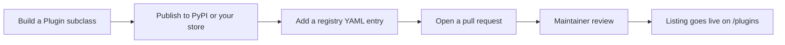

A **plugin** is a Python package that extends Orbit: a new form field, a table column, a dashboard widget, a theme, or a whole feature set such as a blog or a CRM. Because plugins are ordinary packages, anyone can publish one without asking permission.

The **marketplace** is the place people go to find them. It lives at [orbit.almasix.com/plugins](/plugins/) and is built from a registry that ships inside the Orbit repository, so every listing is reviewed through a pull request and every change has an author and a history.

## What a listing gives you

Each listing renders a page with the plugin’s name, summary, price, supported Orbit versions, screenshots, and a long description written by its author. Visitors can filter the directory by price, category, Orbit version, and whether a plugin is dark-mode ready, then jump straight to `pip install` for free plugins or to the author’s checkout for paid ones.

| Piece | Who owns it |
|-------|-------------|
| The code | The plugin author |
| The package on PyPI (or a private store) | The plugin author |
| Pricing, licensing, invoices, refunds | The plugin author |
| Support for the plugin | The plugin author |
| The listing page and its placement | Orbit maintainers |

Orbit never takes a cut and never processes a payment. A paid listing is a link to the author’s own store.

## Official vs community

Listings marked **Official** are built and maintained by Almasix. Everything else is third-party: useful, often excellent, but not security-reviewed by the Orbit team. A plugin runs with the same privileges as the rest of your application — read the source before you deploy it.

If you find malware or a security problem an author will not fix, [open a security advisory](https://github.com/almasix-dev/almasix-orbit/security/advisories/new) and we will unlist the plugin while we investigate.

## The path from idea to listing

1. **Build it.** [Plugin development](/panels/plugins/) covers the `Plugin` class, the `register` / `boot` split, packaging, and asset publishing.
2. **Publish it.** Free plugins go to PyPI so people can `pip install` them. Paid plugins can live anywhere you can sell a wheel.
3. **List it.** [Get listed](/plugins/get-listed/) walks through the registry entry, the images, and the pull request.
4. **Keep it healthy.** [Listing guidelines](/plugins/guidelines/) is what reviewers check against, and [Paid vs free](/plugins/paid-vs-free/) explains the extra rules that apply to commercial plugins.

## Related

- [Browse the marketplace](/plugins/) — the live directory
- [Plugin development](/panels/plugins/) — write the code
- [Render hooks](/panels/render-hooks/) — inject HTML from a plugin
- [Packages](/packages/) — Orbit’s own PyPI map
