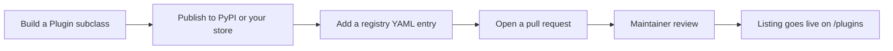

A **plugin** is a Python package that extends Orbit: a new form field, a table column, a dashboard widget, a theme, or a whole feature set such as a blog or a CRM. Because plugins are ordinary packages, anyone can publish one without asking permission.

The **marketplace** is the directory people use to find them. It lives at [orbit.almasix.com/plugins](/plugins/) and is built from a YAML registry inside this repository, so every listing is reviewed through a pull request and every change has an author and a history.


## What a listing gives you

Each listing renders a page with the plugin’s name, summary, price, supported Orbit versions, license, screenshots, install counts, GitHub stars, and a long description written by its author. The listing uses a wide catalog layout: author details, combined star totals, and the author’s other plugins sit in a right-hand aside; related plugins sit in the footer. Visitors can filter the directory by price, category, Orbit version, and whether a plugin is dark-mode ready, then jump to `pip install` for free plugins, to GitHub to star a repository, or to the author’s checkout for paid ones.

Filters are shareable: `/plugins/?q=branding&category=theme&official=1`.


| Piece | Who owns it |
|-------|-------------|
| The code | The plugin author |
| The package on PyPI (or a private store) | The plugin author |
| Pricing, licensing, invoices, refunds | The plugin author |
| Support for the plugin | The plugin author |
| The listing page and its placement | Orbit maintainers |

Orbit never takes a cut and never processes a payment. A paid listing is a link to the author’s own store.

## How the registry is built

```text
docs/src/data/marketplace/
  categories.yaml     # maintainer-owned category list
  authors/*.yaml      # one file per author, filename = slug
  plugins/*.yaml      # one file per listing, filename = slug
```

Astro content collections validate each file against a schema (paid listings need a `checkout_url`; free listings need a package or repository). `npm run validate:marketplace` then checks the things the schema cannot see: filename/slug agreement, reserved URLs, unknown categories or authors, `features.official` only on Almasix listings, and images that are missing from `docs/public`. That script runs in CI and as the docs `prebuild` step, so a bad entry fails the build instead of shipping a half-empty card.

Status values:

| Status | On `/plugins` |
|--------|----------------|
| `published` (default) | Visible |
| `draft` | Hidden — use this to stage an entry |
| `archived` | Hidden — the plugin is no longer offered |

Draft templates (`example-plugin`, `example-author`) ship in the repo so you can copy them. They never appear on the site.

## Official vs community

Listings marked **Official** are built and maintained by Almasix. The author slug must be `almasix`; validators reject `official: true` on anyone else. Everything else is third-party: useful, often excellent, but not security-reviewed by the Orbit team. A plugin runs with the same privileges as the rest of your application — read the source before you deploy it.

If you find malware or a security problem an author will not fix, [open a security advisory](https://github.com/almasix-dev/almasix-orbit/security/advisories/new) and we will unlist the plugin while we investigate.

## Feeds and indexes

| URL | What it is |
|-----|------------|
| [`/plugins/`](/plugins/) | Browse grid |
| [`/plugins/paid/`](/plugins/paid/) | Paid listings only |
| [`/plugins/authors/`](/plugins/authors/) | Authors with published listings |
| [`/plugins/categories/`](/plugins/categories/) | Category index |
| [`/plugins/categories/<slug>/`](/plugins/categories/theme/) | One category |
| [`/plugins/feed.json`](/plugins/feed.json) | JSON catalog for tooling |

The JSON feed includes slug, summary, author, categories, versions, price, package, repository, license, official/featured flags, stars, and installs. It is regenerated with the docs site.

Marketplace pages use a dedicated sidebar (all plugins, paid, authors, building, listing) and a wider content column than the rest of the docs. The home page and the top bar both link to `/plugins/`.

## The path from idea to listing



1. **Build it.** [Plugin development](/panels/plugins/) covers the `Plugin` class, the `register` / `boot` split, packaging, and asset publishing.
2. **Publish it.** Free plugins go to PyPI so people can `pip install` them. Paid plugins can live anywhere you can sell a wheel.
3. **List it.** [Get listed](/plugins/get-listed/) walks through the registry entry, the images, and the pull request.
4. **Keep it healthy.** [Listing guidelines](/plugins/guidelines/) is what reviewers check against, and [Paid vs free](/plugins/paid-vs-free/) explains the extra rules that apply to commercial plugins.

## Related

- [Browse the marketplace](/plugins/) — the live directory
- [Using a plugin](/plugins/using/) — install and register
- [Plugin development](/panels/plugins/) — write the code
- [Render hooks](/panels/render-hooks/) — inject HTML from a plugin
- [Packages](/packages/) — Orbit’s own PyPI map
